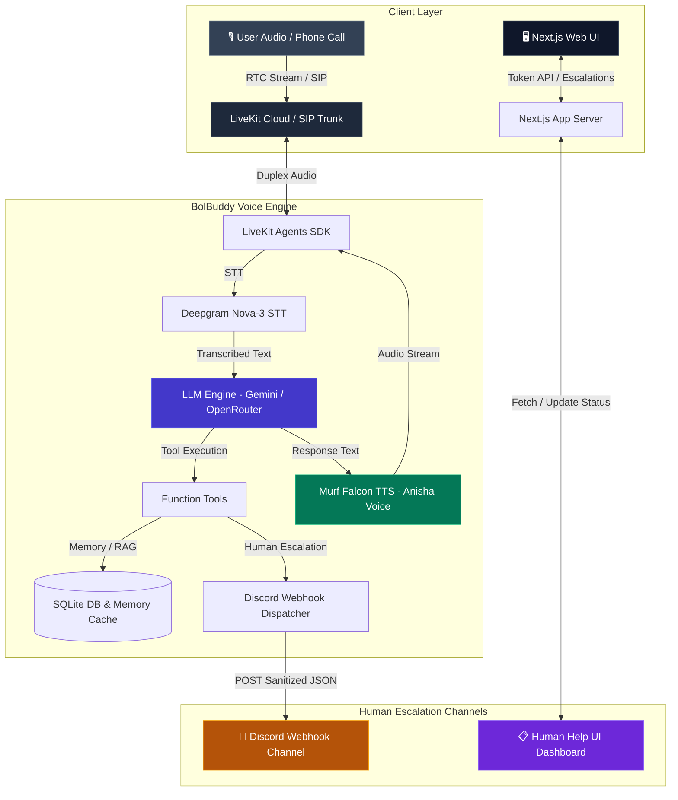

# BolBuddy — Voice-First AI Companion for Spoken English & Viva Prep

**BolBuddy** is a production-grade, real-time voice AI agent designed to help learners practice spoken English, prepare for job interviews and viva exams, track speaking progress over time, receive scheduled daily phone calls, and connect with human mentors when assistance is required.

Powered by **LiveKit Agents SDK**, **Murf Falcon TTS** (Anisha Indian English voice), **Deepgram Nova-3 Multilingual STT**, and **Gemini / OpenRouter LLMs**.

[](https://opensource.org/licenses/MIT) [](https://murf.ai/api/docs/text-to-speech/streaming) [](https://docs.livekit.io) [](https://www.typescriptlang.org/) [](https://www.python.org/)

---

## 🌟 Key Features & Capabilities

- 🎙️ **Real-Time Duplex Audio Streaming**: Instant voice-to-voice interaction using Murf Falcon TTS (55ms latency) and Deepgram Nova-3 Multilingual STT (supporting English, Hindi, and Hinglish).
- 🧠 **Persistent User Memory & Context**: SQLite disk-backed user memory (`bolbuddy_memory.db`) storing learner names, learning goals, preferred topics, and past practice history.
- 📚 **RAG & Learning Resources**: In-memory RAG search engine (`search_learning_resources`) providing instant grammar explanations, viva tips, and sample interview responses.
- 📊 **Structured Practice & Answer Scoring**: Speaking exercises tool (`fetch_next_exercise`) and automated spoken answer evaluation (`score_spoken_answer`) returning structured scores (1-10), strengths, and improvements.
- 📞 **Outbound Telephony & Daily Call Scheduler**: Scheduled automated practice calls to learner phone numbers via Linphone SIP trunk (`OUTBOUND_CALL_ENABLED`).
- 🚨 **Human Escalation & Discord Delivery (Day 7)**: Detects learner distress or human teacher requests, asks explicit permission, scrubs PII, dispatches real-time notifications to a **Discord Webhook channel**, and displays tickets in an internal **Human Help Dashboard UI**.

---

## 🏗 System Architecture



---

## 🗓 7 Days Progress (#VoiceForBharat Challenge)

| Day | Focus Area | Key Deliverables & Code |
| :---: | :--- | :--- |
| **[Day 1](./day_1/README.md)** | Basic Voice Agent Pipeline | Real-time duplex audio streaming using LiveKit Agents, Deepgram Nova-3 STT, and Murf Falcon TTS. |
| **[Day 2](./day_2/README.md)** | Personality & Safety Guardrails | BolBuddy Indian English companion persona, short conversational style, and safety guardrails. |
| **[Day 3](./day_3/README.md)** | Voice UI & Web Interface | Next.js 15 web interface with animated voice orb visualizer, mic controls, and live transcript view. |
| **[Day 4](./day_4/README.md)** | Persistent Memory & RAG | SQLite disk-backed user memory (`bolbuddy_memory.db`), consent-based saving, verbal confirmation before deletion, and RAG resource lookup. |
| **[Day 5](./day_5/README.md)** | Structured Tools & Evaluation | Function tools (`fetch_next_exercise` & `score_spoken_answer`), curated exercise dataset, single-turn LLM response, zero tool syntax leakage, and multi-tier LLM failover. |
| **[Day 6](./day6/README.md)** | Outbound Telephony & Scheduling | Scheduled daily practice calls at learner-selected times via LiveKit SIP Outbound Trunk (Linphone SIP), deterministic state machine, 3-part opening, and short spoken practice. |
| **[Day 7](./day_7/README.md)** | Human Escalation & Discord Channel | Learner distress & teacher request detection, 7-step consent protocol, Discord webhook channel delivery (`DISCORD_ESCALATION_WEBHOOK_URL`), PII scrubbing, and internal Human Help dashboard UI. |

---

## 🚨 Day 7 Feature Spotlight: Human Escalation & Discord Channel

BolBuddy knows its boundaries and recognizes when a learner needs real human help:

### 1. Escalation Triggers
- **Learner Distress**: Learner expresses severe anxiety, frustration, or inability to continue practicing.
- **Human Teacher Request**: Learner explicitly requests to talk to a real human teacher, coach, or English tutor.

### 2. 7-Step Protocol
1. **Detect**: Identifies distress or teacher request without invoking tools prematurely.
2. **Ask Permission**: Speaks a clean, friendly question (*"I can send your concern, language, and preferred follow-up method to our human support team. Is that okay?"*).
3. **Consent YES**: Executes `create_escalation` silently in the backend.
4. **Consent NO**: Respects the learner's decision, creates no ticket, and continues conversation.
5. **PII Sanitization**: Automatically redacts passwords, OTPs, PINs, and bank details.
6. **Discord Webhook POST**: Dispatches formatted payload to `DISCORD_ESCALATION_WEBHOOK_URL`.
7. **Learner Confirmation**: Speaks honest next step (*"Your support request has been initialized. Your reference ID is ESC-XXXX. A human teacher will review your request and contact you within 24 hours."*).

### 3. Real Discord Notification Sample
```text
🚨 New BolBuddy Human Help Request

Reference ID: ESC-1042
Reason: Human Teacher Request
Urgency: Medium
Language: English
Learner: Sakshyam
Preferred Follow-up: Voice call

Summary:
Learner requested one-on-one help from a human English teacher.

What BolBuddy Already Checked:
Normal practice guidance was provided before escalation.

Status: OPEN
```

---

## 🚀 Quickstart & Setup Guide

### Prerequisites
- **Python 3.10+** & **[uv](https://docs.astral.sh/uv/)** package manager
- **Node.js 18+** & **pnpm** package manager
- LiveKit Cloud account & Murf API key

### 1. Clone Repository
```bash
git clone https://github.com/sakshyambhttr-cyber/10_days_voice_agent.git
cd murf-livekit-starter
```

### 2. Configure Environment Variables
Create `.env.local` in `backend/` and `frontend/`:

```ini
# LiveKit Cloud Credentials
LIVEKIT_URL=wss://your-project.livekit.cloud
LIVEKIT_API_KEY=your_api_key
LIVEKIT_API_SECRET=your_api_secret

# AI API Keys
MURF_API_KEY=your_murf_key
DEEPGRAM_API_KEY=your_deepgram_key
GOOGLE_API_KEY=your_google_gemini_key
OPENROUTER_API_KEY=your_openrouter_key

# Day 7 Human Escalation Discord Webhook
DISCORD_ESCALATION_WEBHOOK_URL=https://discord.com/api/webhooks/your_webhook_url

# Day 6 Outbound Telephony (Linphone SIP)
LIVEKIT_SIP_OUTBOUND_TRUNK_ID=your_trunk_id
LINPHONE_USERNAME=your_linphone_user
LINPHONE_PASSWORD=your_linphone_pass
LINPHONE_DOMAIN=sip.linphone.org
OUTBOUND_CALL_ENABLED=true
```

### 3. Install & Run Application

**Option A — All-in-One Startup Script (Recommended):**
```powershell
# Windows PowerShell
.\start_app.ps1

# macOS / Linux
chmod +x start_app.sh
./start_app.sh
```

**Option B — Separate Terminals:**
```bash
# Terminal 1: Backend Agent
cd backend
uv sync
uv run python src/agent.py dev

# Terminal 2: Next.js Frontend
cd frontend
pnpm install
pnpm dev
```

Open **http://localhost:3000** in your browser, click **Talk to BolBuddy**, allow microphone permissions, and start practicing!

---

## 🧪 Automated Testing & Code Quality

BolBuddy features a comprehensive automated test suite including unit tests, API tests, and LLM-as-judge evaluation tests.

```bash
cd backend
uv run pytest
```

```text
============================= test session starts =============================
collected 133 items

test_keys.py ...                                                         [  2%]
tests/test_agent.py .....                                                [  6%]
tests/test_async_memory.py .....                                         [  9%]
tests/test_call_outcomes.py .........                                    [ 16%]
tests/test_consent.py ......                                             [ 21%]
tests/test_day4_two_calls.py .                                           [ 21%]
tests/test_escalation.py ........                                        [ 27%]
tests/test_exercise_tool.py .......                                      [ 33%]
tests/test_final_integration.py ..                                       [ 34%]
...
=========================== 133 passed in 167.32s ===========================
```

- **Ruff Python Linting**: `uv run ruff check src/ tests/` → `All checks passed!`
- **Frontend ESLint & Prettier**: `pnpm lint` & `pnpm format` → Passed cleanly.

---

## 📄 Repository Structure

```text
murf-livekit-starter/
├── backend/                 # Python voice agent (LiveKit Agents + Murf Falcon)
│   ├── src/
│   │   ├── agent.py         # Primary voice pipeline entrypoint & function tools
│   │   ├── escalation_tools.py # Human escalation, PII scrubbing, Discord webhook
│   │   ├── db.py            # SQLite database schema (memory & escalations)
│   │   ├── memory_tools.py  # User context memory & consent handlers
│   │   ├── outbound_agent.py# Outbound telephony SIP call agent
│   │   └── prompts/         # System prompts and persona definitions
│   ├── tests/               # 133 automated pytest unit & LLM evaluation tests
│   └── pyproject.toml       # Python dependencies (uv)
├── frontend/                # Next.js 15 UI for voice interaction
│   ├── app/                 # Next.js pages and API routes (/api/token, /api/escalations)
│   ├── components/          # UI components (agents-ui, bolbuddy-session-view, escalations-drawer)
│   └── package.json         # Node dependencies (pnpm)
├── day_1/ ... day_7/        # Progress snapshots & documentation for each day
├── start_app.ps1            # Windows all-in-one launcher script
├── start_app.sh             # Linux/macOS all-in-one launcher script
└── README.md                # Main repository documentation
```

---

## 🔗 Useful Links & References

- [Murf Falcon TTS API](https://murf.ai/api/docs/text-to-speech/streaming)
- [Murf Voice Library](https://murf.ai/api/docs/voices-styles/voice-library)
- [LiveKit Agents SDK](https://docs.livekit.io/agents)
- [Deepgram STT Documentation](https://developers.deepgram.com)

---

## 📜 License

This project is licensed under the **MIT License**.
