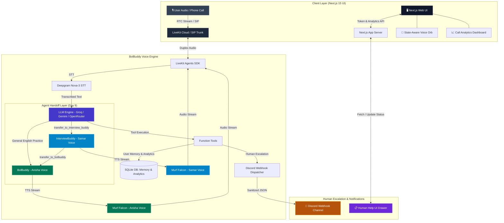

# BolBuddy — Voice-First AI Companion for Spoken English & Viva Prep

**BolBuddy** is a production-grade, real-time voice AI agent designed to help learners practice spoken English, prepare for job interviews and viva exams, track speaking progress with live call analytics, switch seamlessly to specialist interview coaches, receive scheduled daily phone calls, and connect with human mentors when assistance is required.

Powered by **LiveKit Agents SDK**, **Murf Falcon TTS** (Anisha & Samar Indian Multilingual voices), **Deepgram Nova-3 Multilingual STT**, and **Gemini / Groq / OpenRouter LLMs**.

[](https://opensource.org/licenses/MIT) [](https://murf.ai/api/docs/text-to-speech/streaming) [](https://docs.livekit.io) [](https://www.typescriptlang.org/) [](https://www.python.org/)

---

## 🌟 Key Features & Capabilities

- 🎙️ **Real-Time Duplex Audio Streaming**: Ultra-low latency voice-to-voice interaction using Murf Falcon TTS (Anisha Indian female & Samar Indian male voices) and Deepgram Nova-3 Multilingual STT (English, Hindi, Hinglish).
- 🤝 **Specialist Agent Handoff (Day 9)**: Zero-friction transfer between **BolBuddy** (general spoken English & conversation) and **InterviewBuddy** (job & mock interview specialist) with full chat history preservation and automatic voice switching.
- 📈 **Real Call Analytics Dashboard (Day 8)**: Persistent SQLite-backed metrics tracking call volume, duration, success rates, and completed learning activities with real-time UI charts.
- 🔮 **State-Aware Voice Orb & Controls (Day 8)**: Adaptive visualizer reacting in real-time to LiveKit audio levels and state transitions (`IDLE`, `CONNECTING`, `LISTENING`, `THINKING`, `SPEAKING`).
- 🚨 **Human Escalation & Discord Delivery (Day 7)**: Learner distress and teacher request detection, 7-step consent protocol, automatic PII scrubbing, Discord webhook dispatch, and an internal Human Help UI drawer.
- 📞 **Outbound Telephony & Daily Call Scheduler (Day 6)**: Scheduled automated practice calls to learner phone numbers via LiveKit SIP Outbound Trunk (Linphone SIP).
- 📊 **Structured Exercises & Spoken Evaluation (Day 5)**: Spoken exercises (`fetch_next_exercise`) and automated answer scoring (`score_spoken_answer`) with strengths and actionable tips.
- 🧠 **Persistent User Memory & Context (Day 4)**: Disk-backed SQLite user memory (`bolbuddy_memory.db`) storing learner names, goals, topics, and past practice history with explicit consent.
- 📚 **RAG & Learning Knowledge Base (Day 4)**: Fast RAG search engine (`search_learning_resources`) providing instant grammar explanations, viva tips, and sample interview answers.

---

## 🏗 System Architecture



---

## 🗓 9 Days Progress (#VoiceForBharat Challenge)

| Day | Focus Area | Key Deliverables & Code |
| :---: | :--- | :--- |
| **[Day 1](./day_1/README.md)** | Basic Voice Agent Pipeline | Real-time duplex audio streaming using LiveKit Agents, Deepgram Nova-3 STT, and Murf Falcon TTS. |
| **[Day 2](./day_2/README.md)** | Personality & Safety Guardrails | BolBuddy Indian English companion persona, short conversational style, and safety guardrails. |
| **[Day 3](./day_3/README.md)** | Voice UI & Web Interface | Next.js 15 web interface with animated voice visualizer, mic controls, and live transcript view. |
| **[Day 4](./day_4/README.md)** | Persistent Memory & RAG | SQLite disk-backed user memory (`bolbuddy_memory.db`), consent-based saving, verbal confirmation before deletion, and RAG resource lookup. |
| **[Day 5](./day_5/README.md)** | Structured Tools & Evaluation | Function tools (`fetch_next_exercise` & `score_spoken_answer`), curated exercise dataset, single-turn LLM response, zero tool syntax leakage, and multi-tier LLM failover. |
| **[Day 6](./day_6/README.md)** | Outbound Telephony & Scheduling | Scheduled daily practice calls at learner-selected times via LiveKit SIP Outbound Trunk (Linphone SIP), deterministic state machine, 3-part opening, and short spoken practice. |
| **[Day 7](./day_7/README.md)** | Human Escalation & Discord Channel | Learner distress & teacher request detection, 7-step consent protocol, Discord webhook channel delivery (`DISCORD_ESCALATION_WEBHOOK_URL`), PII scrubbing, and internal Human Help dashboard UI. |
| **[Day 8](./day_8/README.md)** | Call Analytics Dashboard & Voice Orb | Real SQLite call tracking (`call_analytics`), dynamic outcome classification, interactive analytics drawer, state-aware Voice Orb, and accessible mic controls. |
| **[Day 9](./day_9/README.md)** | Specialist Agent Handoff (InterviewBuddy) | Seamless multi-agent handoff between BolBuddy and InterviewBuddy specialist, chat context preservation, Murf Falcon voice switching (Anisha ↔ Samar), and animated UI handoff banners. |

---

## 🤝 Day 9 Feature Spotlight: Specialist Agent Handoff

BolBuddy introduces multi-agent orchestration for specialized learning tracks:

```
[ Learner ] ──(General English practice)──> [ BolBuddy (Anisha Voice) ]
                                                   │
                                     "I have an interview next week"
                                                   │
                                                   ▼ transfer_to_interview_buddy
[ Learner ] ──(Mock Interview coaching)───> [ InterviewBuddy (Samar Voice) ]
                                                   │
                                     "Let's chat casually again"
                                                   │
                                                   ▼ transfer_to_bolbuddy
[ Learner ] ──(General English practice)──> [ BolBuddy (Anisha Voice) ]
```

### Key Capabilities:
1. **Murf Falcon Voice Persona Switching**:
   - **BolBuddy**: Warm, conversational Indian female voice (**Anisha**).
   - **InterviewBuddy**: Articulate, professional Indian male mock interview coach (**Samar**).
2. **Instant Context Transfer**: Existing learner goals, target roles, and practice topics transfer across agents without repetition (`chat_ctx.copy()`).
3. **Frontend Handoff Indicators**: Dedicated agent badges, animated transition pill, specialist info cards, and sanitized transcripts.

---

## 📊 Day 8 Feature Spotlight: Call Analytics & Voice Orb

- **Persistent Call Logging**: Automatically records session duration, channel (Browser/SIP), activities completed, and success classification.
- **Dynamic Metrics**: Live calculation of total calls, success rate %, failed calls, and completed practice exercises.
- **State-Aware Voice Orb**: Directly bound to LiveKit session state without polling or timers.

---

## 🚀 Quickstart & Setup Guide

### Prerequisites
- **Python 3.10+** & **[uv](https://docs.astral.sh/uv/)** package manager
- **Node.js 18+** & **pnpm** package manager
- LiveKit Cloud account & Murf API key

### 1. Clone Repository
```bash
git clone https://github.com/sakshyambhttr-cyber/10_days_voice_agent.git
cd murf-livekit-starter
```

### 2. Configure Environment Variables
Create `.env.local` in `backend/` and `frontend/`:

```ini
# LiveKit Cloud Credentials
LIVEKIT_URL=wss://your-project.livekit.cloud
LIVEKIT_API_KEY=your_api_key
LIVEKIT_API_SECRET=your_api_secret

# AI API Keys
MURF_API_KEY=your_murf_key
DEEPGRAM_API_KEY=your_deepgram_key
GROQ_API_KEY=your_groq_key
GOOGLE_API_KEY=your_google_gemini_key
OPENROUTER_API_KEY=your_openrouter_key

# Day 7 Human Escalation Discord Webhook
DISCORD_ESCALATION_WEBHOOK_URL=https://discord.com/api/webhooks/your_webhook_url

# Day 6 Outbound Telephony (Linphone SIP)
LIVEKIT_SIP_OUTBOUND_TRUNK_ID=your_trunk_id
LINPHONE_USERNAME=your_linphone_user
LINPHONE_PASSWORD=your_linphone_pass
LINPHONE_DOMAIN=sip.linphone.org
OUTBOUND_CALL_ENABLED=true
```

### 3. Install & Run Application

**Option A — All-in-One Startup Script (Recommended):**
```powershell
# Windows PowerShell
.\start_app.ps1

# macOS / Linux
chmod +x start_app.sh
./start_app.sh
```

**Option B — Separate Terminals:**
```bash
# Terminal 1: Backend Voice Agent
cd backend
uv sync
uv run python src/agent.py dev

# Terminal 2: Next.js Frontend
cd frontend
pnpm install
pnpm dev
```

Open **http://localhost:3000** in your browser, click **Talk to BolBuddy**, allow microphone permissions, and start practicing!

---

## 🧪 Automated Testing & Code Quality

BolBuddy features a comprehensive automated test suite including unit tests, telephony tests, and LLM-as-judge evaluation tests.

```bash
cd backend
uv run pytest
```

- **Specialist Handoff Tests**: `uv run pytest tests/test_handoff.py -v`
- **Call Analytics Tests**: `uv run pytest tests/test_analytics.py -v`
- **Human Escalation Tests**: `uv run pytest tests/test_escalation.py -v`
- **Telephony Tests**: `uv run pytest tests/test_telephony.py -v`
- **Ruff Python Linting**: `uv run ruff check src/ tests/` → `All checks passed!`
- **Frontend Lint & Typecheck**: `pnpm lint && pnpm format:check` → Clean.

---

## 📁 Repository Structure

```text
murf-livekit-starter/
├── backend/                       # Python voice agent (LiveKit Agents + Murf Falcon)
│   ├── src/
│   │   ├── agent.py               # Main agent pipeline & Assistant / InterviewBuddy classes
│   │   ├── escalation_tools.py    # Human escalation, PII scrubbing, Discord webhook
│   │   ├── db.py                  # SQLite database schema (memory, escalations, analytics)
│   │   ├── groq_key_manager.py    # Multi-key LLM rotation & failover
│   │   ├── memory_tools.py        # User context memory & consent handlers
│   │   ├── outbound.py            # Outbound telephony SIP call agent
│   │   └── prompts/               # BolBuddy & InterviewBuddy prompt modules
│   ├── tests/                     # 70+ automated pytest unit & LLM evaluation tests
│   └── pyproject.toml             # Python dependencies (uv)
├── frontend/                      # Next.js 15 UI for voice interaction
│   ├── app/                       # Pages and API routes (/api/token, /api/analytics, /api/escalations)
│   ├── components/                # UI components (voice-orb, analytics-dashboard, handoff-banner)
│   ├── hooks/                     # Custom hooks (useActiveAgent, useAgentErrors)
│   └── package.json               # Node dependencies (pnpm)
├── day_1/ ... day_9/              # Progress snapshots & documentation for each day
├── start_app.ps1                  # Windows all-in-one launcher script
├── start_app.sh                   # Linux/macOS all-in-one launcher script
└── README.md                      # Main repository documentation
```

---

## 🔗 Useful Links & References

- [Murf Falcon TTS API](https://murf.ai/api/docs/text-to-speech/streaming)
- [Murf Voice Library](https://murf.ai/api/docs/voices-styles/voice-library)
- [LiveKit Agents SDK](https://docs.livekit.io/agents)
- [Deepgram STT Documentation](https://developers.deepgram.com)

---

## 📜 License

This project is licensed under the **MIT License**.
