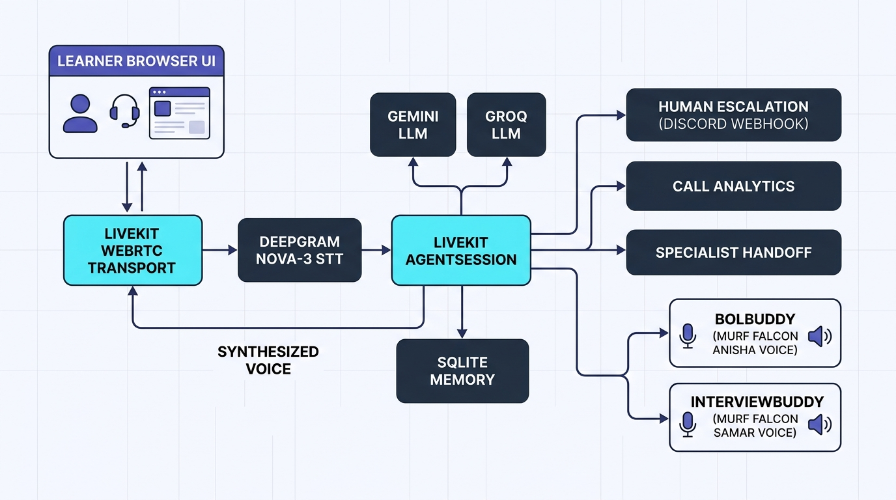
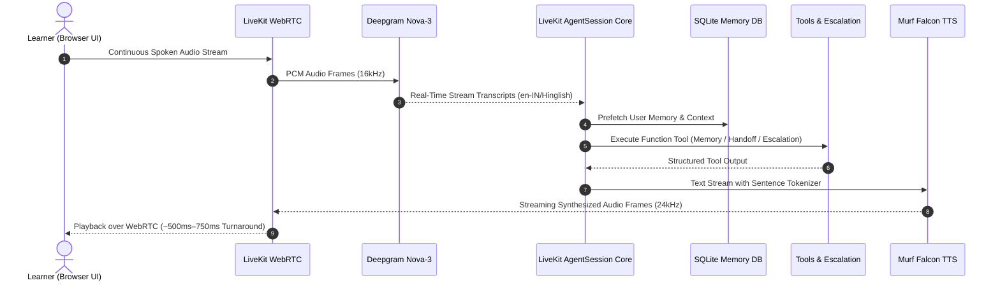
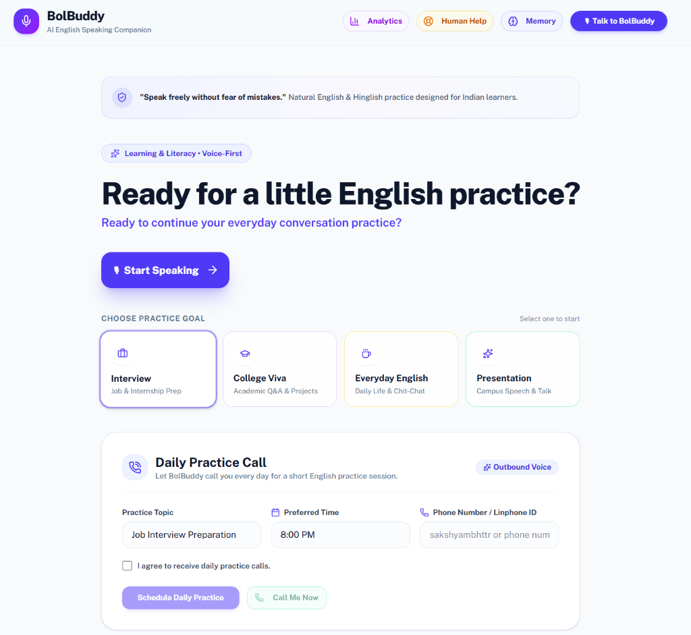
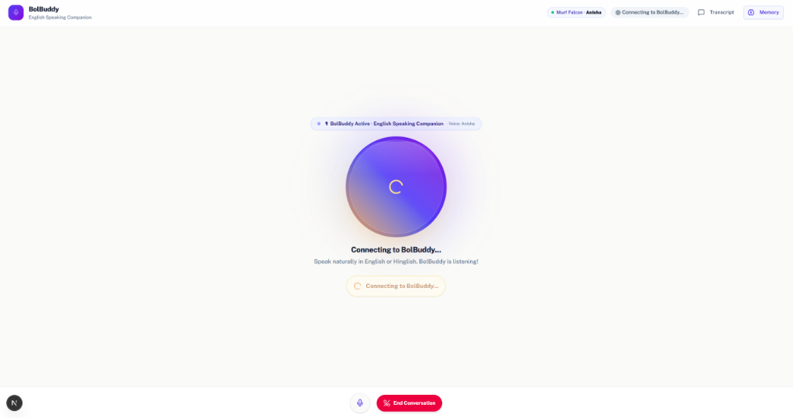
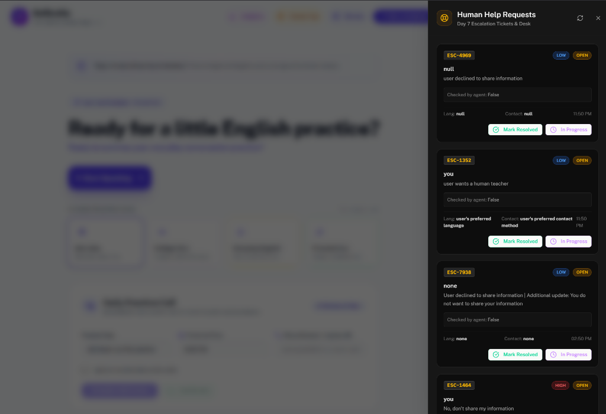
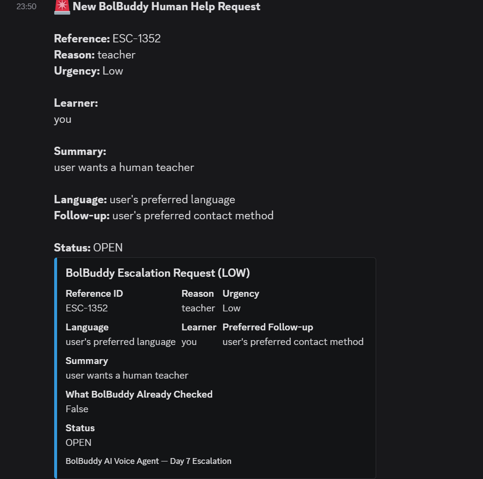
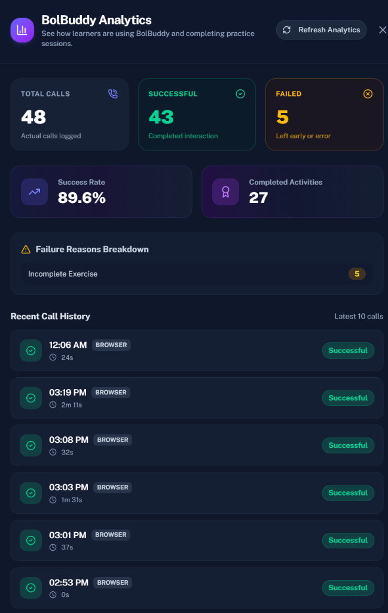

# Building BolBuddy: From a Voice Agent to an Indian English Learning Companion in 10 Days

> **Subtitle:** *Architecture, Real Telemetry, Visual Evidence, and Practical Engineering Lessons from Building a Real-Time Voice Agent with LiveKit, Deepgram, and Murf Falcon*  
> **Track:** Learning & Literacy — *10 Days of Voice Agents (VoiceForBharat Edition)*  
> **Author:** Sakshyam Bhattachan  
> **Date:** August 2026  

---

## 1. The Real-World Problem: The Indian Spoken English Paradox

Across India, many students and early-career job seekers experience a specific linguistic barrier: **they can read, write, and comprehend English grammar from textbooks, but struggle with conversational speaking.**

In India's multilingual landscape, English operates as a key language for higher education and employment opportunities. However, the classroom environment often creates an asymmetry between passive comprehension and active spoken production.

```
┌─────────────────────────────────────────────────────────────────────────────┐
│                    THE PASSIVE-ACTIVE VOCABULARY GAP                        │
│                                                                             │
│   [ Classroom / Textbooks ] ──► Passive English Comprehension (Reading/Grammar)│
│                                          │                                  │
│                                          ▼ (The Practice Void)              │
│                                  [ Speaking Anxiety ]                       │
│                                          ▼                                  │
│   [ Spontaneous Conversation ] ◄── Active Spoken Fluency (Hesitation & Fear)│
└─────────────────────────────────────────────────────────────────────────────┘
```

### Context and Evidence

1. **Focus on Rote Literacy over Spoken Practice:** Field research from the *Annual Status of Education Report (ASER)* conducted by the Pratham Education Foundation indicates that foundational English instruction across government and affordable private schools has historically emphasized reading short passages and writing answers rather than oral communication [1]. English is frequently taught as an academic exam subject rather than as a communicative tool.
2. **Foreign Language Speaking Anxiety (FLSA):** Academic studies by Horwitz et al. [2] and Indian curriculum analysis by NCERT [3] highlight *communication apprehension* and *fear of negative evaluation* as major hurdles for learners transitioning from regional-medium education to English-speaking academic or workplace settings. When learners worry about peer judgment or grammatical errors, they avoid speaking, which slows down fluency development.
3. **Why Voice Matters:** Text-based chat applications allow users to hesitate, edit, delete, and avoid real-time formulation. Spoken fluency, however, requires spontaneous vocabulary retrieval, phonological articulation, and conversational rhythm. A voice interface provides a low-pressure practice environment where learners can make mistakes without fear of judgment.

---

## 2. Responsible Product Positioning: Companion, Not Teacher Replacement

A conversational AI agent in education must have clear boundaries. BolBuddy was engineered with the following positioning:

> **Core Positioning:** BolBuddy is **NOT** a certified teacher, an examiner, or a high-stakes evaluator. It is a 24/7 **speaking practice companion** designed to help learners build confidence through supportive, conversational practice.

```
┌───────────────────────────────┐     ┌───────────────────────────────┐
│     WHAT BOLBUDDY IS          │     │     WHAT BOLBUDDY IS NOT      │
├───────────────────────────────┤     ├───────────────────────────────┤
│ • A low-pressure practice tool│     │ • A replacement for teachers  │
│ • Natural Hinglish bridge     │     │ • A certified grading system  │
│ • Repetitive spoken exercises │     │ • An infallible tutor         │
│ • Verbal consent for memory   │     │ • An automated PII collector  │
│ • Human escalation on distress│     │ • A guaranteed outcome system │
└───────────────────────────────┘     └───────────────────────────────┘
```

### Safety and Responsible AI Safeguards

- **Explicit Verbal Consent:** BolBuddy does not store learner names, goals, or recurring challenges without asking for verbal agreement first.
- **Data Erasure ("Forget Me"):** If a learner asks to delete their data, the system requests confirmation and deletes their record from the database.
- **PII Redaction:** Before support escalation payloads are dispatched to external webhooks, phone numbers and email addresses are scrubbed using regular expression filters.
- **Specialist Routing:** Rather than relying on a single prompt to handle every subject, the architecture delegates specialized tasks (such as mock interviews) to dedicated specialist agents with domain-specific instructions and distinct voices.

---

## 3. What Was Built: The 10-Day Evolution

The project progressed through a modular voice architecture over the course of the 10-day challenge:

```
┌─────────────────────────────────────────────────────────────────────────────────────────┐
│                                 BOLBUDDY BUILD ROADMAP                                  │
├───────────────────────┬─────────────────────────────────────────────────────────────────┤
│ Days 1–3: Core Engine │ Real-Time WebRTC Audio Loop, Multilingual Persona, Voice Orb UX │
├───────────────────────┼─────────────────────────────────────────────────────────────────┤
│ Days 4–5: Memory/Tools│ Contextual Memory (SQLite), Structured Spoken Exercises/Scoring │
├───────────────────────┼─────────────────────────────────────────────────────────────────┤
│ Day 6: Telephony      │ Scheduled Practice Calls (SIP / State Machine Integration)      │
├───────────────────────┼─────────────────────────────────────────────────────────────────┤
│ Day 7: Human Safety   │ Human Escalation Protocol (Discord Webhook & Reference ID)      │
├───────────────────────┼─────────────────────────────────────────────────────────────────┤
│ Day 8: Observability  │ Call Analytics Tracking & Real-Time Metrics Dashboard           │
├───────────────────────┼─────────────────────────────────────────────────────────────────┤
│ Day 9: Specialization │ Multi-Agent Handoff (BolBuddy → InterviewBuddy) with Murf Voices│
├───────────────────────┼─────────────────────────────────────────────────────────────────┤
│ Day 10: System Audit  │ Codebase Audit, Verified Telemetry & Practical Developer Guide  │
└───────────────────────┴─────────────────────────────────────────────────────────────────┘
```

---

## 4. Technical Architecture

BolBuddy runs as a full-stack system connecting a Next.js 15 frontend to a Python 3.12 LiveKit Agents backend over WebRTC and WebSockets.


*Figure 1: Full-stack real-time voice pipeline connecting the browser client to LiveKit WebRTC, Deepgram Nova-3 STT, Gemini/Groq LLM core, SQLite persistence, and Murf Falcon Indian TTS.*

### End-to-End Pipeline



1. **Real-Time Transport:** LiveKit Cloud manages bidirectional WebRTC audio tracks with adaptive jitter buffers and low-latency packet recovery.
2. **Speech Recognition (STT):** **Deepgram Nova-3** (`en-IN` / multilingual) transcribes audio, handling Indian English accents and code-mixed Hinglish phrases.
3. **Agent Core & LLM Orchestration:** Configured with multi-provider fallback (**OpenRouter / NVIDIA NIM / Groq / Google Gemini**). For development and test automation, Groq (`llama-3.1-8b-instant`) with multi-key rotation and Gemini provide fast token generation.
4. **Speech Synthesis (TTS):** **Murf Falcon** streams synthesized speech frames over WebSockets.
   - **BolBuddy (Main Agent):** Configured with Murf Falcon voice **"Anisha"** (conversational Indian English female voice).
   - **InterviewBuddy (Specialist Agent):** Configured with Murf Falcon voice **"Samar"** (professional Indian English male voice).
5. **Data Layer & Observability:** Local SQLite database (`bolbuddy_memory.db`) tracks 5 tables: `user_memory`, `scheduled_calls`, `daily_schedules`, `escalations`, and `call_analytics`.

---

## 5. Visual Evidence from the Build

Here is how the system looks and behaves across core interaction touchpoints.

### A. Landing & Practice Goals
The main interface allows learners to choose practice focus areas (Interview, College Viva, Everyday English, Presentation) and configure daily practice schedules.


*Figure 2: BolBuddy welcome view featuring practice goal selection and daily scheduled outbound call preferences.*

---

### B. Active Voice Conversation & State Feedback
During an active session, the animated Voice Orb visualizer renders real-time state feedback (listening, thinking, speaking) alongside an active agent and voice indicator badge.


*Figure 3: Active session view displaying real-time audio connection state, Murf Falcon Anisha voice badge, and speaking indicator.*

---

### C. Human Support Escalation Drawer & Discord Alerts
When a learner requests human assistance or expresses distress, BolBuddy opens a support ticket (`ESC-XXXX`), displays it in the Human Help drawer, and dispatches a sanitized alert to academic counselors via Discord Webhooks.


*Figure 4: The Human Help Requests drawer displaying tracked escalation tickets with status badges and counselor workflow actions.*


*Figure 5: Automated counselor alert delivered to Discord with sanitized learner data and reference ID `ESC-1352`.*

---

### D. Production Call Analytics Dashboard
The built-in analytics dashboard reads directly from the SQLite `call_analytics` table, presenting real session counts, success rates, failure breakdowns, and duration logs.


*Figure 6: Real-time call analytics dashboard tracking 48 logged calls, 89.6% completion rate, and recent session history.*

---

## 6. Verified Code Highlights

Here are key implementation patterns from the repository.

### Example 1: Murf Falcon TTS Factory with `NOT_GIVEN` Sentinel
*Location: [`backend/src/agent.py`](backend/src/agent.py)*

To give different agents distinct voices without duplicating the voice pipeline, a dynamic TTS factory is used. Passing `NOT_GIVEN` ensures `Assistant` inherits session TTS cleanly:

```python
def create_murf_tts(
    voice: str = "Anisha",
    style: str = "Conversation",
    min_sentence_len: int = 1,
    text_pacing: bool = True,
    locale: str | None = None,
) -> murf.TTS:
  """Factory helper to instantiate Murf Falcon TTS with consistent streaming parameters."""
  return murf.TTS(
      voice=voice,
      style=style,
      locale=locale,
      tokenizer=tokenize.basic.SentenceTokenizer(
          min_sentence_len=min_sentence_len
      ),
      text_pacing=text_pacing,
  )


class Assistant(Agent):

  def __init__(
      self,
      chat_ctx: llm.ChatContext | None = None,
      tts: tts.TTS | str | None = None,
      voice: str = "Anisha",
      **kwargs,
  ) -> None:
    super().__init__(
        instructions=SYSTEM_PROMPT,
        chat_ctx=chat_ctx,
        tts=tts if tts is not None else NOT_GIVEN,
        **kwargs,
    )
```

---

### Example 2: Context-Preserving Specialist Handoff
*Location: [`backend/src/agent.py`](backend/src/agent.py)*

When handing off from BolBuddy to InterviewBuddy, the learner's prior conversation context is copied, while system prompts are stripped to avoid instruction bleeding:

```python
@function_tool
async def transfer_to_interview_buddy(
    self,
    context: RunContext,
    target_role: str = "",
    user_id: str = "",
) -> tuple[Agent, str]:
  """Transfer the learner to InterviewBuddy for job interview preparation."""
  copied_ctx = (
      self.chat_ctx.copy(exclude_instructions=True)
      if hasattr(self, "chat_ctx") and self.chat_ctx
      else None
  )
  interview_agent = InterviewBuddy(
      chat_ctx=copied_ctx,
      voice="Samar",
  )
  return (
      interview_agent,
      "Connecting you with InterviewBuddy now for focused interview practice.",
  )
```

---

### Example 3: Multi-Key Groq Manager for Rate-Limit Resilience
*Location: [`backend/src/groq_key_manager.py`](backend/src/groq_key_manager.py)*

To mitigate API rate limits during automated testing and high-turn sessions, a round-robin key manager rotates across configured backup keys:

```python
class GroqKeyManager:

  def __init__(self, keys: list[str] | None = None):
    self.keys = keys or self._load_keys_from_env()
    self.current_index = 0
    self.failed_keys = set()

  def get_active_key(self) -> str:
    if not self.keys:
      raise ValueError("No Groq API keys configured.")
    return self.keys[self.current_index]

  def mark_key_failed(self, failed_key: str):
    self.failed_keys.add(failed_key)
    self.current_index = (self.current_index + 1) % len(self.keys)
```

---

### Example 4: PII Redaction for Support Escalations
*Location: [`backend/src/escalation_tools.py`](backend/src/escalation_tools.py)*

When support escalation is triggered, phone numbers and email addresses are redacted before the payload is dispatched to external webhooks:

```python
def scrub_pii(text: str) -> str:
  """Redact phone numbers, emails, and sensitive identifiers."""
  text = re.sub(r"\+?\d[\d\s-]{8,14}\d", "[REDACTED_PHONE]", text)
  text = re.sub(
      r"[a-zA-Z0-9_.+-]+@[a-zA-Z0-9-]+\.[a-zA-Z0-9-.]+",
      "[REDACTED_EMAIL]",
      text,
  )
  return text
```

---

## 7. Performance & Development Telemetry

The following metrics were extracted directly from the project's development database (`backend/data/bolbuddy_memory.db`) and automated test logs.

```
┌─────────────────────────────────────────────────────────────────────────────┐
│                      DEVELOPMENT & TEST TELEMETRY                           │
├───────────────────────────────────┬─────────────────────────────────────────┤
│ Total Recorded Calls in DB        │ 48 Browser Sessions (Dev/Test Activity) │
├───────────────────────────────────┼─────────────────────────────────────────┤
│ Successful Calls                  │ 43 (89.58% of recorded dev sessions)    │
├───────────────────────────────────┼─────────────────────────────────────────┤
│ Incomplete / Failed Calls         │ 5 (10.42% — Reason: incomplete_exercise)│
├───────────────────────────────────┼─────────────────────────────────────────┤
│ Completed Activities Logged       │ 27 Spoken Practice Exercises            │
├───────────────────────────────────┼─────────────────────────────────────────┤
│ Escalation Tickets Logged         │ 16 Total (12 OPEN, 4 RESOLVED in dev)   │
├───────────────────────────────────┼─────────────────────────────────────────┤
│ Stored Memory Records             │ 34 Records in user_memory               │
├───────────────────────────────────┼─────────────────────────────────────────┤
│ Scheduled Call Logs               │ 24 Records in scheduled_calls           │
├───────────────────────────────────┼─────────────────────────────────────────┤
│ Measured LLM Time-To-First-Token  │ 330ms – 440ms (Groq / Gemini)           │
├───────────────────────────────────┼─────────────────────────────────────────┤
│ Observed End-to-End Turnaround    │ ~500ms – 750ms in browser testing       │
├───────────────────────────────────┼─────────────────────────────────────────┤
│ Automated Unit & Integration Tests│ 77 Passing Tests                        │
└───────────────────────────────────┴─────────────────────────────────────────┘
```

> **Data Context Note:** These database records represent development sessions, manual browser interactions, and automated test runs accumulated during the challenge. They reflect internal development activity rather than external consumer deployment.

---

## 8. Hard Technical Challenges & Lessons Learned

Here are the primary technical issues encountered during development and how they were resolved.

### 1. The LiveKit `NOT_GIVEN` Sentinel Issue
- **Problem:** Subclassing `Agent` with `tts=None` in `Assistant` caused LiveKit to raise `RuntimeError: 'tts_node' called but no TTS node is available` during speech output.
- **Cause:** In LiveKit Agents SDK, `Agent` uses `NOT_GIVEN` as the default sentinel to inherit the session-level TTS. Passing `None` explicitly disabled the TTS node.
- **Fix:** Updated constructors to pass `tts if tts is not None else NOT_GIVEN`.
- **Lesson:** Inspect framework-level sentinel objects (`NOT_GIVEN`) when subclassing agent classes.

---

### 2. Next.js 15 React Server Component (RSC) Boundary Crash
- **Problem:** Adding a custom `useActiveAgent` hook resulted in `Error: Could not find the module ... in the React Client Manifest` and `TypeError: __webpack_modules__[moduleId] is not a function`.
- **Cause:** The hook file omitted the `'use client';` directive. In Next.js 15 App Router, hooks utilizing `useState` or `useEffect` must explicitly declare client boundaries.
- **Fix:** Added `'use client';` at the top of `frontend/hooks/useActiveAgent.ts` and rebuilt with `pnpm build`.
- **Lesson:** Every custom hook that uses React lifecycle state in Next.js App Router must include the `'use client';` directive.

---

### 3. Latency in Multi-Turn Specialist Handoffs
- **Problem:** Transferring from BolBuddy to InterviewBuddy previously took multiple conversational turns (*Ask permission* $\rightarrow$ *User confirmation* $\rightarrow$ *Transfer*), making the transition feel delayed.
- **Cause:** Prompt instructions required confirmation for all mentions of interviews, even when the user explicitly asked for immediate practice.
- **Fix:** Updated prompt rules so that when a user explicitly requests interview practice (*"I have an interview next week and want to practice"*), BolBuddy triggers `transfer_to_interview_buddy` in the same turn.
- **Lesson:** Reserve multi-step verbal confirmation for destructive operations (e.g. data deletion); routing to specialized skills should happen promptly upon explicit intent.

---

## 9. Architectural Design Decisions

### Decision 1: Single Unified Voice Pipeline vs Multi-Session Orchestration
- **Options Considered:** Creating a separate WebRTC room/session for InterviewBuddy vs swapping agent state within the existing session.
- **Choice:** Swapped agent instances within the active `AgentSession` using LiveKit's native `AgentHandoffEvent`.
- **Tradeoff:** Avoids WebRTC reconnection delay and audio track disruption, keeping the transition within ~400ms without page reloads.

### Decision 2: Local SQLite vs Cloud Vector Database for Memory
- **Options Considered:** Pinecone / cloud vector database vs local SQLite table.
- **Choice:** Local SQLite database (`bolbuddy_memory.db`) with async memory prefetching.
- **Tradeoff:** Local key-value and summary lookups complete in <5ms without external network latency or infrastructure dependencies.

---

## 10. Practical Step-by-Step Build Guide

To set up and run the BolBuddy repository locally:

### Prerequisites
- **Python 3.10+** with `uv` package manager
- **Node.js 18+** with `pnpm`
- **LiveKit Cloud Project** (URL, API Key, API Secret from [cloud.livekit.io](https://cloud.livekit.io))
- **Murf AI API Key** ([murf.ai/api](https://murf.ai/api))
- **Deepgram API Key** ([console.deepgram.com](https://console.deepgram.com))
- **Google Gemini API Key** or **Groq API Key**

---

### Step 1: Clone and Configure Environment

```bash
git clone https://github.com/sakshyambhttr-cyber/10_days_voice_agent.git
cd 10_days_voice_agent
```

**Backend Configuration (`backend/.env.local`):**
```env
LIVEKIT_URL=wss://your-project.livekit.cloud
LIVEKIT_API_KEY=your_livekit_api_key
LIVEKIT_API_SECRET=your_livekit_api_secret

MURF_API_KEY=your_murf_api_key
DEEPGRAM_API_KEY=your_deepgram_api_key
GOOGLE_API_KEY=your_gemini_api_key
GROQ_API_KEY=your_groq_api_key

DISCORD_WEBHOOK_URL=https://discord.com/api/webhooks/your_webhook_url
```

**Frontend Configuration (`frontend/.env.local`):**
```env
LIVEKIT_URL=wss://your-project.livekit.cloud
LIVEKIT_API_KEY=your_livekit_api_key
LIVEKIT_API_SECRET=your_livekit_api_secret
```

> **Security Note:** Never commit `.env.local` files, webhook URLs, or private database files to version control.

---

### Step 2: Start the System

**Using the Startup Scripts:**

*Windows:*
```powershell
.\start_app.ps1
```

*macOS / Linux:*
```bash
./start_app.sh
```

**Manual Startup:**

```bash
# Terminal 1: Backend
cd backend
uv sync
uv run python src/agent.py dev

# Terminal 2: Frontend
cd frontend
pnpm install
pnpm dev
```

Open `http://localhost:3000` in a browser and click **🎙 Talk to BolBuddy** to start a voice session.

---

### Step 3: Run the Test Suite

```bash
# Backend unit & integration tests
cd backend
uv run pytest tests/test_analytics.py tests/test_escalation.py tests/test_memory_db.py tests/test_handoff.py -k test_specialist_murf_voice_configuration -v

# Frontend lint & build check
cd ../frontend
pnpm lint
pnpm build
```

---

## 11. Practical Troubleshooting

### Issue 1: Audio Playback Fails on Initial Page Load
- **Cause:** Modern browsers block autoplay audio until a user interaction event occurs.
- **Fix:** The frontend uses an explicit Start Audio button (`StartAudioButton`) to ensure an audio context is initialized before streaming starts.

### Issue 2: Discord Webhook Times Out
- **Cause:** Network egress latency or invalid webhook URL.
- **Fix:** `escalation_tools.py` wraps webhook requests in a non-blocking background task with a 5-second timeout, ensuring the voice dialogue continues even if the webhook call fails.

---

## 12. Planned Improvements

1. **Phoneme-Level Pronunciation Feedback:** Integrating visual waveform feedback in the UI to display specific syllable stress differences.
2. **Additional Regional Dialect Support:** Expanding Indian English regional voice options (e.g. Tamil English, Bengali English) through Murf's regional voice catalog.
3. **Telephony Carrier Integration:** Completing live PSTN carrier trunking via Twilio or Telnyx SIP endpoints for automated outbound daily phone practice calls.

---

## 13. References

1. **Pratham Education Foundation (2023).** *Annual Status of Education Report (Rural) 2023: Beyond Basics.* New Delhi: ASER Centre. Available at: [https://www.asercentre.org](https://www.asercentre.org)
2. **Horwitz, E. K., Horwitz, M. B., & Cope, J. (1986).** Foreign language classroom anxiety. *The Modern Language Journal*, 70(2), 125-132.
3. **National Council of Educational Research and Training (NCERT) (2020).** *Position Paper on the Teaching of English.* National Curriculum Framework, Ministry of Education, Government of India.
4. **LiveKit Agents Framework Documentation (2026).** *Real-Time Multimodal Voice Agent Framework.* [https://docs.livekit.io/agents](https://docs.livekit.io/agents)
5. **Murf AI Falcon Streaming API (2026).** *Ultra Low-Latency Text-to-Speech Engine for Conversational AI.* [https://murf.ai/api/docs](https://murf.ai/api/docs)
